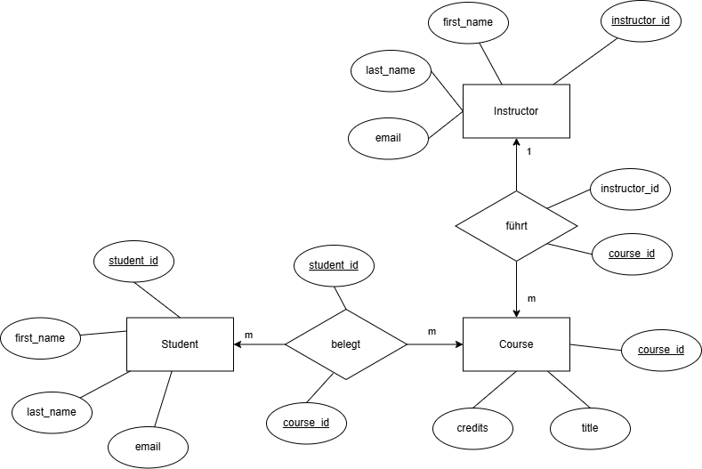

# [Hochschuk Kursplattform]

- Marcus Heri
- Jan Bruggmann
- Dominik Schwager

## Projektidee

Die Anwendung bildet eine Hochschul Kursplattform ab, auf der Studierende Kurse belegen können. Dozierende bieten verschiedene Kurse an. Studierende können sich Kurse aussuchen und sich einschreiben. Die App bietet ein Formular für Kursbuchungen und eine Ansicht für belegte Kurse. Das Ziel ist, die grundlegenden Strukturen einer realen Kursverwaltung digital abzubilden.

## ER Modell

Das Datenmodell umfasst drei zentrale Entitätstypen:
- Student – Studierende einer Hochschule
- Instructor – Dozierende, die Kurse anbieten
- Course – Kurse mit Titel, Credits und zuständigem Instructor

Beziehungstypen:
- führt: Ein Instructor führt mehrere Kurse, Kardinalität: 1 Instructor : n Kurse
- belegt: Ein Student kann mehrere Kurse belegen, und ein Kurs kann von mehreren Studierenden belegt werden, Kardinalität: m Studenten : m Kurse

## Beschreibung der Streamlit-App

Wichtig sind folgende zwei Punkte:

### 1. Eingabeformular (was wird erfasst?)
Belegung eines Kurses durch Eingabe von:
- Student ID
- Kurs ID

### 2. Datenanzeige (welche Abfrage wird angezeigt?)
- Anzeige aller belegten Kurse eines ausgewählten Studenten
- Inklusive Kursinformationen und Dozierenden

## Auführen der App

**Wichtig:** Testet dass folgende Schritte funktionieren:

1. `pip install -r requirements.txt`
2. `python setup_db.py`
3. `python -m streamlit run streamlit_app.py`
